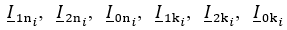

### Prediction-of-the-maximum-value-of-induced-voltage-on-a-disconnected-power-line

### Горшков Андрей Вячеславович
### Прогнозирование максимального значения наведенного напряжения на отключенной линии электропередачи

**1 Постановка задачи**

При отключении линии электропередачи (ЛЭП) на ней токами влияющих ЛЭП (соседние работающие ЛЭП) неизбежно наводится напряжение некоторого значения. При превышении наведенного напряжения предельно допустимого значения 25 В возникает опасность поражения персонала, проводящего работы на отключенной ЛЭП, электрическим током.

Отсюда следует постановка задачи: определить в заданной точке отключенной ЛЭП максимально возможное значение модуля наведенного напряжения u_max при изменении фазных токов влияющих ЛЭП в пределах диапазонов их возможных значений.

**2 Метод определения значения u_max**

Для определения достоверного максимально возможного значения наведенного напряжения u_max предлагается использовать следующий метод, в основе которого лежат три операции.

Первая операция – проведение на отключенной ЛЭП (до проведения на ней работ) в течении некоторого интервала времени серии из M синхронных измерений комплексных значений наведенного напряжения и фазных токов влияющих ЛЭП.

Вторая операция – определение неизвестных коэффициентов  линейной регрессии наведенного напряжения посредством машинного обучения на результатах натурных измерений наведенного напряжения.

Третья операция – вычисление значения u_max по следующему выражению [1]

где  – максимально возможные значения модулей токов симметричных составляющих в начале и конце i-ой влияющей ЛЭП.

**3 Специфические особенности задачи определения значения u_max**

Поставленная задача определения максимально возможного значения наведенного напряжения по своей сути является задачей экстраполяции регрессии комплексных чисел. Данная задача имеет специфические особенности, которые накладывают ограничения на использование стандартных методов машинного обучения. 

Первая особенность данной задачи заключается в принципиальной невозможности использования для экстраполяции регрессии широко используемых ансамблевых алгоритмов на основе деревьев решений и опорных векторов, так как за пределами обучающего набора данных модели на этих алгоритмах являются константными. Для решения задачи экстраполяции следует использовать алгоритмы линейной регрессии или нейронные сети.

Вторая особенность данной задачи заключается в том, что стандартные алгоритмы машинного обучения не поддерживают работу с комплексными числами. Это обстоятельство не позволяет использовать популярные библиотеки машинного обучения для построения модели регрессии на данных, содержащих комплексные числа. Отсюда возникает постановка вспомогательной задачи: выполнить математически обоснованное преобразование исходного датасета с комплексными числами в датасет с вещественными числами, которое позволит для построения модели регрессии комплексных чисел использовать стандартные алгоритмы машинного обучения, поддерживающие работу только с вещественными числами.

**4 Алгоритмы, используемые для обучения моделей регрессии**

**4.1 Алгоритмы из библиотеки Scikit-learn**

Обучение моделей в данной работе выполнено на языке программирования Python 3. Для построения моделей использовались следующие алгоритмы линейной регрессии из библиотеки Scikit-learn – LinearRegression, использующий метод наименьших квадратов, а также Ridge, SGDRegressor, Lasso и BayesianRidge, использующие различные виды регуляризации. 

Оптимальные значения гиперпараметров моделей регрессии определялись двумя способами – поиском по сетке и применением алгоритма Optuna.

**4.2 Алгоритм регуляризации Тихонова с использованием априорной информации**

Алгоритм регуляризации Тихонова [2] с использованием априорной информации о погрешностях измерения предикторов и целевой переменной позволяет получить устойчивое решение для плохообусловленных систем линейных алгебраических уравнений (СЛАУ) с данными, заданными с некоторой погрешностью. В данной задаче наведенного напряжения мультиколлинеарность предикторов как раз и приводит к плохой обусловленности СЛАУ. При этом измерения значений целевой переменной и предикторов всегда проводятся с некоторыми погрешностями, значения которых предполагаем известными. 

Отличие алгоритма регуляризации Тихонова от алгоритма Ridge из Scikit-learn состоит в том, что коэффициент регуляризации α определяется по условию оптимизации нестандартной метрики – обобщенной невязки, учитывающей погрешности измерения предикторов и целевой переменной [2].

**5 Пример определения значения u_max**

Проведение серийных измерений значений наведенного на отключенной ЛЭП напряжения и фазных токов влияющих ЛЭП пока еще не практикуется. Поэтому для примера решения поставленной задачи использовались синтетические датасеты, содержащие по 1000 объектов, имитирующих результаты измерений. Каждый сгенерированный датасет представляет собой одну и ту же случайно заданную серию измерений наведенного напряжения с погрешностями измерений δ_A = 0,01, δ_b = 0,05.

Наибольшее для всех сгенерированных датасетов значение модуля целевой переменной – наведенного напряжения составило 6,7 В.
Максимально возможное значение наведенного напряжения u_max определялось для следующих максимально возможных значений токов влияющих ЛЭП.

Токи прямой последовательности: 1500 А; 1200 А; 1600 А; 1600 А; 1200 А.

Токи обратной последовательности: 150 А; 120 А; 160 А; 160 А; 120 А.

Токи нулевой последовательности: 97,5 А; 78 А; 104 А; 104 А; 78 А.

Обучение моделей проводилось при разбиении данных на обучающую и тестовую выборки в соотношении 80/20.

Модели строились для каждого выявленного кластера данных в отдельности с использованием всех предикторов, которые масштабировались относительно наибольшего по модулю значения методом MaxAbsScaler.

**6 Анализ результатов определения значения u_max**

Условно точный прогноз Accurate максимально возможного значения наведенного напряжения u_max, вычисленный по используемым для генерации датасетов коэффициентам регрессии, составляет 91,6 В. Значение Accurate используется в качестве эталонного значения для проверки точности прогнозирования различными моделями.

В таблице 7 приведены средние значения (mean), смещения (bias) и среднеквадратичные отклонения (√variance) прогнозов для рассмотренных датасетов, выполненные различными алгоритмами, обученными на данных кластеров №1.

Таблица 1 – Значения mean, bias и √variance для прогнозов различных алгоритмов 

Результаты прогнозов всех алгоритмов регрессий из библиотеки Scikit-learn не только имеют неприемлемую точность, но и являются неустойчивыми – сравнительно небольшие погрешности измерений предикторов и целевой переменной δ_A = 0,01 и δ_b = 0,05 приводят к недопустимым погрешностям прогноза целевой переменной (в терминологии машинного обучения это означает, что модели переобучаются). Для сгенерированных датасетов смещения прогнозов различных алгоритмов регрессий составляют (по модулю) от 11% до 124%, а среднеквадратичные отклонения – от 5% до 57%. Наихудшие прогнозы для алгоритмов Scikit-learn выдает не использующий регуляризацию алгоритм LinearRegression, наилучшие прогнозы – алгоритм SGDRegressor.

Наилучшие устойчивые прогнозы с приемлемой точностью выдает алгоритм регуляризации Тихонова, учитывающий априорную информацию о погрешностях измерения данных. Для сгенерированных датасетов смещение прогнозов алгоритма регуляризации Тихонова составляет (по модулю) 9%, а среднеквадратичное отклонение – 2%.

**Выводы**

1. Для определения достоверного максимально возможного значения наведенного напряжения на отключенной ЛЭП разработан метод, в основе которого лежит построение математической модели регрессии наведенного напряжения посредством машинного обучения на данных, полученных путем натурных измерений наведенного напряжения и фазных токов влияющих ЛЭП.

2. Полученный в результате натурных измерений набор данных может иметь кластеры, соответствующие периодам с разными нагрузками влияющих ЛЭП и направлениями передачи энергии. Для определения достоверного максимально возможного значения наведенного напряжения необходимо проводить обучение обособленных моделей для каждого кластера данных с последующим анализом и отбором построенных моделей.

3. Стандартные алгоритмы машинного обучения не поддерживают работу с комплексными числами, которыми описывается наведенное напряжение, что не позволяет использовать популярные библиотеки машинного обучения для построения модели регрессии на данных, содержащих комплексные числа. 

4. Разработан метод преобразования исходного набора данных с комплексными числами в набор данных с вещественными числами, который позволяет для построения модели регрессии комплексных чисел использовать стандартные алгоритмы машинного обучения, поддерживающие работу только с вещественными числами.

5. Модели, использующие алгоритмы линейной регрессии из библиотеки Scikit-learn, обученные на наборах данных с мультиколлинеарными предикторами – фазными токами, могут привести к крайне неточным и неустойчивым прогнозам наведенного напряжения.

6. Для наборов данных с мультиколлинеарными предикторами для получения приемлемо точных и устойчивых прогнозов наведенного напряжения следует использовать модель регуляризации Тихонова, учитывающую априорную информацию о погрешностях измерения предикторов и целевой переменной.

**Список литературы**

1. Горшков А. В. Определение максимального значения наведенного напряжения в рассматриваемой точке отключенной воздушной линии электропередачи. – Электричество, 2017, № 11. – С. 12 - 21.

2. Тихонов А. Н., Гончарский А. В., Степанов В.В., Ягола А. Г. Регуляризирующие алгоритмы и априорная информация. – М.: Наука, 1983. – 200 с.